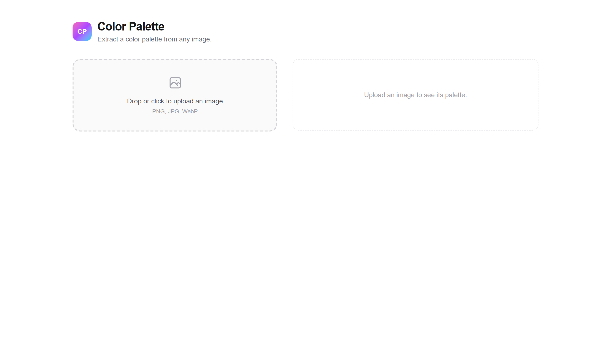

# Color Palette from Image

[](https://github.com/kamarajendra/color-palette-from-image/actions/workflows/ci.yml)
[](https://github.com/kamarajendra/color-palette-from-image/releases)
[](https://github.com/kamarajendra/color-palette-from-image/blob/main/LICENSE)

Upload an image and extract its dominant colors as OKLCH, HEX, and RGB values. No server, no API, no uploads. Everything runs in the browser.

## Screenshot



## Features

- Drag-and-drop or click to upload
- Extracts top 8 dominant colors
- Shows HEX, OKLCH, and RGB values per swatch
- CSS variable export
- 100% client-side canvas processing

## Tech Stack

- Next.js 16 App Router
- React 19
- TypeScript
- Tailwind CSS 4
- Vitest

## Getting Started

```bash
npm install
npm run dev
```

## License

MIT
